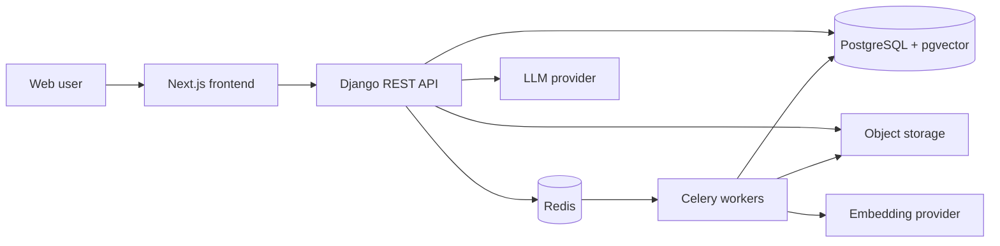

# KnowledgeVault AI

KnowledgeVault AI is a planned multi-user retrieval-augmented generation (RAG) platform for securely organizing documents and asking grounded questions across private organizational knowledge bases.

> **Project status:** Phase 0 (architecture and planning) is complete. Application code has not been scaffolded yet. The next approved slice is Phase 1A, described in the [roadmap](docs/ROADMAP.md).

## Product vision

The finished platform will let individuals and teams:

- Create isolated organization workspaces and invite members.
- Create multiple knowledge bases with role-aware access.
- Upload PDF, DOCX, TXT, and Markdown files for asynchronous processing.
- Search authorized content with vector and keyword retrieval.
- Ask questions and receive grounded answers with validated citations.
- Inspect sources, provide feedback, and monitor usage and processing health.

The design prioritizes tenant isolation, transparent RAG logic, testability, and honest no-answer behavior.

## Planned architecture

The monorepo will contain a Django REST API, Celery workers, a Next.js frontend, PostgreSQL with pgvector, Redis, and Nginx. Development and production deployments will use separate Docker Compose configurations.



See [Architecture](docs/ARCHITECTURE.md), [Database design](docs/DATABASE.md), and [RAG pipeline](docs/RAG_PIPELINE.md) for the complete Phase 0 design.

## Technology plan

| Area | Planned technology |
| --- | --- |
| Backend | Python 3.12, Django, Django REST Framework |
| Tasks | Celery and Redis |
| Data | PostgreSQL, pgvector, PostgreSQL full-text search |
| AI | Sentence Transformers behind an embedding interface; OpenRouter behind an LLM interface |
| Frontend | Next.js, React, TypeScript, Tailwind CSS, accessible UI primitives |
| API | Versioned REST API with OpenAPI via drf-spectacular |
| Infrastructure | Docker Compose, Nginx, Gunicorn/Uvicorn, S3-compatible production storage |
| Quality | pytest, Ruff, mypy where practical, frontend unit/E2E tests, GitHub Actions |

Exact dependency versions will be selected and pinned during Phase 1 after compatibility checks.

## Repository layout

Current Phase 0 files:

```text
.
|-- AGENTS.md
|-- README.md
|-- .gitignore
`-- docs/
    |-- ARCHITECTURE.md
    |-- DATABASE.md
    |-- DAILY_PROGRESS.md
    |-- ENVIRONMENT.md
    |-- PROJECT_CHECKLIST.md
    |-- RAG_PIPELINE.md
    |-- ROADMAP.md
    `-- adr/
        `-- 0001-use-postgresql-pgvector.md
```

The `backend/`, `frontend/`, Docker, and infrastructure directories will be created during Phase 1 rather than represented by empty placeholders.

## Local setup

There is no runnable application in Phase 0. The existing local `venv/` is machine-specific, is excluded by `.gitignore`, and should not be committed.

Phase 1 will document a one-command Docker development setup. The expected workflow will be:

```bash
cp .env.example .env
docker compose -f docker-compose.yml -f docker-compose.dev.yml up --build
```

PowerShell equivalent:

```powershell
Copy-Item .env.example .env
docker compose -f docker-compose.yml -f docker-compose.dev.yml up --build
```

These commands are planned and will not work until Phase 1 creates the referenced files.

## Environment variables

Secrets and environment-specific values must never be committed. The complete variable plan, ownership, validation rules, and rollout order are in [Environment plan](docs/ENVIRONMENT.md). Phase 1 will provide a safe `.env.example` with non-secret placeholders.

## Development commands

Test, lint, migration, and Docker commands will be added when their configurations exist in Phase 1. No test suite currently exists, and no passing-test claim is made.

## API documentation

The API will live under `/api/v1/` and expose generated OpenAPI schema and interactive documentation. Endpoint examples will be added to `docs/API.md` alongside implementation phases.

## Security

Tenant isolation is release-blocking. Every organization-owned query—including vector retrieval and citation lookup—must be scoped to the authenticated user's authorized organization and knowledge base. Uploaded documents are untrusted data and must never override system instructions.

See [Architecture: tenant isolation](docs/ARCHITECTURE.md#tenant-isolation) and [RAG pipeline: prompt-injection boundaries](docs/RAG_PIPELINE.md#prompt-injection-boundaries).

## Deployment

The target deployment uses immutable application images, Nginx, externally managed secrets, PostgreSQL backups, Redis, S3-compatible object storage, health checks, structured logs, and non-root containers where practical. Production deployment is deferred until Phase 13 and will not be automated before explicit configuration.

## Screenshots

Screenshots will be added after the relevant UI exists. No mock screenshot is presented as working product functionality.

## Known limitations

- The repository currently contains planning documentation only.
- No backend, frontend, database, task worker, or container has been implemented.
- No automated tests exist yet.
- The local virtual environment discovered during assessment is not portable and its configured base Python executable is inaccessible on this machine.
- Authentication, storage, streaming, and deployment details remain subject to their dedicated ADRs.

## Roadmap

Development is divided into Phases 0 through 14. See [Roadmap](docs/ROADMAP.md) for deliverables, acceptance criteria, dependencies, and the exact next slice.

## License and contributions

`LICENSE`, `CONTRIBUTING.md`, and `SECURITY.md` will be added during the project-foundation and hardening phases. Until a license is added, no open-source license is granted.
