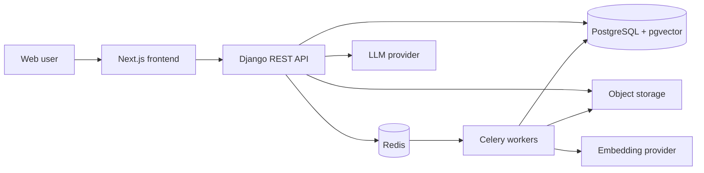

# KnowledgeVault AI

KnowledgeVault AI is a planned multi-user retrieval-augmented generation (RAG) platform for securely organizing documents and asking grounded questions across private organizational knowledge bases.

> **Project status:** The backend foundation and typed Next.js authentication frontend are implemented. Phase 2 includes registration, secure browser JWT authentication, profiles, password changes, email verification, password recovery, durable email delivery, protected frontend routes, and account screens. Organization and knowledge-base work is next.

## Product vision

The finished platform will let individuals and teams:

- Create isolated organization workspaces and invite members.
- Create multiple knowledge bases with role-aware access.
- Upload PDF, DOCX, TXT, and Markdown files for asynchronous processing.
- Search authorized content with vector and keyword retrieval.
- Ask questions and receive grounded answers with validated citations.
- Inspect sources, provide feedback, and monitor usage and processing health.

The design prioritizes tenant isolation, transparent RAG logic, testability, and honest no-answer behavior.

## Planned architecture

The monorepo will contain a Django REST API, Celery workers, a Next.js frontend, PostgreSQL with pgvector, Redis, and Nginx. Development and production deployments will use separate Docker Compose configurations.



The diagram above summarizes the planned service boundaries. Implementation is proceeding incrementally from the Django and PostgreSQL foundation.

## Technology plan

| Area | Planned technology |
| --- | --- |
| Backend | Python 3.12+ (3.13.5 verified), Django 5.2.16 LTS |
| Tasks | Celery 5.6 with Redis 8.2 as the broker |
| Data | PostgreSQL, pgvector, PostgreSQL full-text search |
| AI | Sentence Transformers behind an embedding interface; OpenRouter behind an LLM interface |
| Frontend | Next.js, React, TypeScript, Tailwind CSS, accessible UI primitives |
| API | Django REST Framework 3.17.1, Simple JWT 5.5.1, django-filter, CORS allow-listing, and OpenAPI via drf-spectacular |
| Infrastructure | Docker Compose, Nginx, Gunicorn/Uvicorn, S3-compatible production storage |
| Quality | pytest, pytest-cov, Ruff, mypy where practical, frontend unit/E2E tests, GitHub Actions |

Active backend dependencies and development tools are pinned in `backend/pyproject.toml`. Later-phase dependencies will be added only when their features are introduced.

## Repository layout

Current foundation files:

```text
.
|-- README.md
|-- .gitignore
|-- .env.example
|-- backend/
|   |-- Dockerfile
|   |-- manage.py
|   |-- pyproject.toml
|   |-- config/celery.py
|   `-- apps/
|       |-- accounts/
|       `-- health/
|-- frontend/
|   |-- app/
|   |-- components/
|   |-- lib/
|   |-- services/
|   |-- tests/
|   |-- Dockerfile
|   `-- package.json
|-- docker/
|   `-- postgres/init/
|-- docker-compose.yml
`-- docker-compose.dev.yml
```

## Local setup

PowerShell setup from the repository root:

```powershell
Copy-Item .env.example .env
python -m venv venv
.\venv\Scripts\Activate.ps1
python -m pip install --upgrade pip
python -m pip install --editable ".\backend[dev]"
docker compose -f docker-compose.yml -f docker-compose.dev.yml up -d --build
docker compose -f docker-compose.yml -f docker-compose.dev.yml exec -T backend python manage.py migrate
```

Bash equivalent:

```bash
cp .env.example .env
python -m venv venv
source venv/bin/activate
python -m pip install --upgrade pip
python -m pip install --editable "./backend[dev]"
docker compose -f docker-compose.yml -f docker-compose.dev.yml up -d --build
docker compose -f docker-compose.yml -f docker-compose.dev.yml exec -T backend python manage.py migrate
```

The Next.js application is available on `localhost:3000`, the Django API on `localhost:8000`, PostgreSQL on `localhost:5432`, and Redis on `localhost:6380`. Redis uses a non-default host port to avoid conflicting with other local projects; containers still reach it on port `6379`. Named volumes preserve database, Redis, and frontend dependency data when containers stop. Do not use the known development credentials from `.env.example` in any deployed environment.

## Environment variables

Secrets and environment-specific values must never be committed. Copy `.env.example` to the ignored `.env` file for local development. Development loads this root file without overriding variables already supplied by the shell. Production never loads `.env` and fails closed when required settings are absent.

## Development commands

Current verification commands:

```powershell
.\venv\Scripts\ruff.exe check backend
.\venv\Scripts\ruff.exe format --check backend
.\venv\Scripts\pytest.exe backend --config-file backend\pyproject.toml
.\venv\Scripts\python.exe backend\manage.py check
Set-Location frontend
npm ci
npm run lint
npm run typecheck
npm run test
npm run build
```

The pytest command measures branch coverage for `apps` and `config` and fails below 90%.

## Accounts and authentication

The project uses `accounts.User` from its first migration. Users have UUID primary keys, normalized email login identities, full names, optional avatars, active/staff flags, email-verification state, password hashes, login dates, and audit timestamps. PostgreSQL enforces both normal uniqueness and case-insensitive email uniqueness. Django Admin uses the custom model and never exposes password hashes as editable plain text.

`POST /api/v1/auth/register/` creates an account from `email`, `full_name`, and `password`. It normalizes email addresses, applies Django password validation, caps password input length, handles duplicate-email races safely, never returns the password, and uses a dedicated limit of five attempts per hour. Successful registration does not issue tokens; that begins in the JWT authentication slice.

Browser authentication uses a five-minute access token returned in JSON and a rotating seven-day refresh token stored only in an HttpOnly cookie. Login, refresh, and logout require Django CSRF validation. Refresh rotation blacklists the previous token, logout revokes the current refresh token, and password changes invalidate already-issued access and refresh tokens. Login responses never expose refresh tokens, authentication responses are marked `no-store`, and targeted login throttles limit repeated credential attempts.

The authentication endpoints are:

- `GET /api/v1/auth/csrf/` — creates a CSRF cookie and returns the corresponding header token.
- `POST /api/v1/auth/login/` — validates credentials, returns an access token, and sets the refresh cookie.
- `POST /api/v1/auth/refresh/` — rotates the refresh cookie and returns a new access token.
- `POST /api/v1/auth/logout/` — revokes the refresh token and clears its cookie.
- `POST /api/v1/auth/password/change/` — confirms the current password, validates and saves a replacement, revokes every existing token, and clears the refresh cookie.
- `POST /api/v1/auth/email/verification/resend/` — sends a new verification link only to the authenticated user's account email.
- `POST /api/v1/auth/email/verification/confirm/` — verifies an email using an expiring, single-use token.
- `POST /api/v1/auth/password/reset/request/` — returns an enumeration-safe response and queues recovery email delivery through Celery.
- `POST /api/v1/auth/password/reset/confirm/` — validates a single-use recovery token, changes the password, and revokes every existing token.

The authenticated user endpoint is:

- `GET /api/v1/users/me/` — returns only the current user's safe profile fields and never exposes password or administrative state.
- `PATCH /api/v1/users/me/` — updates the current user's full name; email, verification state, avatar, and administrative fields are rejected.

The typed Next.js frontend provides landing, registration, login, forgot-password, reset-password, email-verification, protected dashboard, profile editing, verification resend, password change, and logout experiences. Access tokens remain only in application memory. The refresh credential remains in the backend-managed HttpOnly cookie, and the frontend restores a page-reloaded session through the documented CSRF and refresh flow. Concurrent refresh attempts share one request, and protected routes do not render private content while restoration is unresolved.

The implemented operational endpoints are:

- `GET /api/v1/health/live/` — confirms the Django process can serve requests.
- `GET /api/v1/health/ready/` — confirms PostgreSQL, Redis, and at least one Celery worker are available.

The REST API uses authenticated access by default, JSON-only requests and responses, bounded page-number pagination, filtering/search/ordering backends, request throttling, and an `X-Request-ID` response header. API failures use a consistent envelope containing a safe error code, message, details, and request ID.

Readiness returns HTTP `503` with a safe per-dependency status when any required service is unavailable. Liveness remains dependency-free so the Django process can be distinguished from its supporting services.

The Docker backend uses Django's development server with source-code mounting and automatic reload. To run Django directly from the virtual environment instead:

```powershell
.\venv\Scripts\python.exe backend\manage.py runserver
```

Inspect the database and pgvector version:

```powershell
docker compose -f docker-compose.yml -f docker-compose.dev.yml exec -T postgres psql -U knowledgevault -d knowledgevault -c "SELECT current_setting('server_version'), extversion FROM pg_extension WHERE extname = 'vector';"
```

Verify Redis directly:

```powershell
docker compose -f docker-compose.yml -f docker-compose.dev.yml exec -T redis redis-cli ping
```

Verify the Celery worker directly:

```powershell
docker compose -f docker-compose.yml -f docker-compose.dev.yml exec -T celery_worker celery -A config inspect ping --timeout 5
```

Inspect the full development stack or follow backend logs:

```powershell
docker compose -f docker-compose.yml -f docker-compose.dev.yml ps
docker compose -f docker-compose.yml -f docker-compose.dev.yml logs -f backend
```

The backend container waits for healthy PostgreSQL and Redis services, runs as a non-root user, and becomes healthy only when `/api/v1/health/ready/` succeeds. It intentionally does not apply migrations automatically.

Tasks use JSON-only messages, late acknowledgement, one-message prefetch, bounded execution time, and no result backend by default. Verification and password-reset requests first persist a PostgreSQL outbox row; Celery messages contain only its UUID. Celery Beat recovers broker dispatch failures and abandoned worker leases every minute. Domain workflows store durable state in PostgreSQL when required.

Migrations are applied explicitly rather than during container startup. The accounts user, email-verification, password-reset, durable email-delivery, Django, and Simple JWT blacklist migrations are applied in the development database.

## API documentation

The versioned API lives under `/api/v1/`. The generated OpenAPI schema is available at `GET /api/v1/schema/`, and interactive Swagger documentation is available at `GET /api/v1/docs/`. Both documentation endpoints and the health endpoints are intentionally public; application endpoints require authentication by default. Endpoint examples will be added as product APIs are implemented.

## Security

Tenant isolation is release-blocking. Every organization-owned query—including vector retrieval and citation lookup—must be scoped to the authenticated user's authorized organization and knowledge base. Uploaded documents are untrusted data and must never override system instructions.

## Deployment

The target deployment uses immutable application images, Nginx, externally managed secrets, PostgreSQL backups, Redis, S3-compatible object storage, health checks, structured logs, and non-root containers where practical. Production deployment is deferred until Phase 13 and will not be automated before explicit configuration.

## Screenshots

Screenshots will be added after the relevant UI exists. No mock screenshot is presented as working product functionality.

## Known limitations

- The account lifecycle and its frontend foundation are implemented; organization and product-domain APIs are not implemented yet.
- The Django API, Next.js frontend, PostgreSQL/pgvector, Redis, Celery worker, and Celery Beat services are configured; Nginx and production Compose remain pending.
- One hundred sixty-six backend tests and four subtests pass with 99.91% measured coverage, while eleven frontend tests cover credential handling, form validation, session restoration, and protected-route behavior. Live end-to-end browser coverage remains pending.
- The repaired local virtual environment is usable but not portable and must not be committed.
- Production settings fail closed and include an initial secure baseline, but full production hardening remains Phase 13 work.
- Storage, streaming, and deployment details remain future architectural decisions.
- Durable email delivery is at-least-once; an SMTP acceptance followed by a worker crash may lead to a later replacement email.

## Roadmap

Development is divided into Phases 0 through 14. Phase 1 currently focuses on the backend, database, background-task, and container foundations.

## License and contributions

`LICENSE`, `CONTRIBUTING.md`, and `SECURITY.md` will be added during the project-foundation and hardening phases. Until a license is added, no open-source license is granted.
