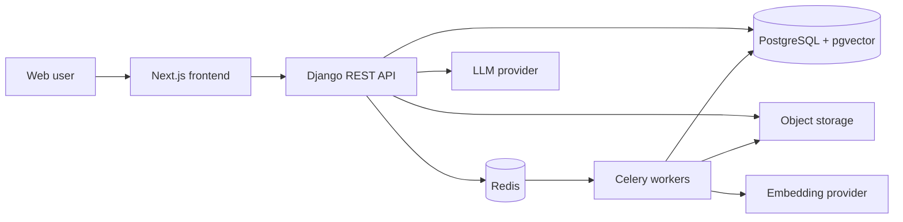

# KnowledgeVault AI

KnowledgeVault AI is a planned multi-user retrieval-augmented generation (RAG) platform for securely organizing documents and asking grounded questions across private organizational knowledge bases.

> **Project status:** Phase 0 is complete and Phase 1 is active. The containerized Django API, PostgreSQL 17 with pgvector, Redis, and Celery worker are healthy and integrated. The frontend remains the next major foundation slice.

## Product vision

The finished platform will let individuals and teams:

- Create isolated organization workspaces and invite members.
- Create multiple knowledge bases with role-aware access.
- Upload PDF, DOCX, TXT, and Markdown files for asynchronous processing.
- Search authorized content with vector and keyword retrieval.
- Ask questions and receive grounded answers with validated citations.
- Inspect sources, provide feedback, and monitor usage and processing health.

The design prioritizes tenant isolation, transparent RAG logic, testability, and honest no-answer behavior.

## Planned architecture

The monorepo will contain a Django REST API, Celery workers, a Next.js frontend, PostgreSQL with pgvector, Redis, and Nginx. Development and production deployments will use separate Docker Compose configurations.



The diagram above summarizes the planned service boundaries. Implementation is proceeding incrementally from the Django and PostgreSQL foundation.

## Technology plan

| Area | Planned technology |
| --- | --- |
| Backend | Python 3.12+ (3.13.5 verified), Django 6.0.7 |
| Tasks | Celery 5.6 with Redis 8.2 as the broker |
| Data | PostgreSQL, pgvector, PostgreSQL full-text search |
| AI | Sentence Transformers behind an embedding interface; OpenRouter behind an LLM interface |
| Frontend | Next.js, React, TypeScript, Tailwind CSS, accessible UI primitives |
| API | Versioned REST API with OpenAPI via drf-spectacular |
| Infrastructure | Docker Compose, Nginx, Gunicorn/Uvicorn, S3-compatible production storage |
| Quality | pytest, Ruff, mypy where practical, frontend unit/E2E tests, GitHub Actions |

Active backend dependencies and development tools are pinned in `backend/pyproject.toml`. Later-phase dependencies will be added only when their features are introduced.

## Repository layout

Current foundation files:

```text
.
|-- README.md
|-- .gitignore
|-- .env.example
|-- backend/
|   |-- Dockerfile
|   |-- manage.py
|   |-- pyproject.toml
|   |-- config/celery.py
|   `-- apps/
|       `-- health/
|-- docker/
|   `-- postgres/init/
|-- docker-compose.yml
`-- docker-compose.dev.yml
```

The `frontend/` and remaining infrastructure services will be created during later Phase 1 slices rather than represented by empty placeholders.

## Local setup

PowerShell setup from the repository root:

```powershell
Copy-Item .env.example .env
python -m venv venv
.\venv\Scripts\Activate.ps1
python -m pip install --upgrade pip
python -m pip install --editable ".\backend[dev]"
docker compose -f docker-compose.yml -f docker-compose.dev.yml up -d --build
```

Bash equivalent:

```bash
cp .env.example .env
python -m venv venv
source venv/bin/activate
python -m pip install --upgrade pip
python -m pip install --editable "./backend[dev]"
docker compose -f docker-compose.yml -f docker-compose.dev.yml up -d --build
```

The Django API is available on `localhost:8000`, PostgreSQL on `localhost:5432`, and Redis on `localhost:6380`. Redis uses a non-default host port to avoid conflicting with other local projects; containers still reach it on port `6379`. Named volumes preserve database and Redis data when containers stop. Do not use the known development credentials from `.env.example` in any deployed environment.

## Environment variables

Secrets and environment-specific values must never be committed. Copy `.env.example` to the ignored `.env` file for local development. Development loads this root file without overriding variables already supplied by the shell. Production never loads `.env` and fails closed when required settings are absent.

## Development commands

Current verification commands:

```powershell
.\venv\Scripts\ruff.exe check backend
.\venv\Scripts\ruff.exe format --check backend
.\venv\Scripts\pytest.exe backend --config-file backend\pyproject.toml
.\venv\Scripts\python.exe backend\manage.py check
```

The implemented operational endpoints are:

- `GET /api/v1/health/live/` — confirms the Django process can serve requests.
- `GET /api/v1/health/ready/` — confirms PostgreSQL, Redis, and at least one Celery worker are available.

Readiness returns HTTP `503` with a safe per-dependency status when any required service is unavailable. Liveness remains dependency-free so the Django process can be distinguished from its supporting services.

The Docker backend uses Django's development server with source-code mounting and automatic reload. To run Django directly from the virtual environment instead:

```powershell
.\venv\Scripts\python.exe backend\manage.py runserver
```

Inspect the database and pgvector version:

```powershell
docker compose -f docker-compose.yml -f docker-compose.dev.yml exec -T postgres psql -U knowledgevault -d knowledgevault -c "SELECT current_setting('server_version'), extversion FROM pg_extension WHERE extname = 'vector';"
```

Verify Redis directly:

```powershell
docker compose -f docker-compose.yml -f docker-compose.dev.yml exec -T redis redis-cli ping
```

Verify the Celery worker directly:

```powershell
docker compose -f docker-compose.yml -f docker-compose.dev.yml exec -T celery_worker celery -A config inspect ping --timeout 5
```

Inspect the full development stack or follow backend logs:

```powershell
docker compose -f docker-compose.yml -f docker-compose.dev.yml ps
docker compose -f docker-compose.yml -f docker-compose.dev.yml logs -f backend
```

The backend container waits for healthy PostgreSQL and Redis services, runs as a non-root user, and becomes healthy only when `/api/v1/health/ready/` succeeds. It intentionally does not apply migrations automatically.

Tasks use JSON-only messages, late acknowledgement, one-message prefetch, bounded execution time, and no result backend by default. Domain workflows will store durable progress and outcomes in PostgreSQL when their models are introduced.

No persistent Django migrations should be applied until the custom user model is introduced.

## API documentation

The API will live under `/api/v1/` and expose generated OpenAPI schema and interactive documentation. Endpoint examples will be added as the corresponding APIs are implemented.

## Security

Tenant isolation is release-blocking. Every organization-owned query—including vector retrieval and citation lookup—must be scoped to the authenticated user's authorized organization and knowledge base. Uploaded documents are untrusted data and must never override system instructions.

## Deployment

The target deployment uses immutable application images, Nginx, externally managed secrets, PostgreSQL backups, Redis, S3-compatible object storage, health checks, structured logs, and non-root containers where practical. Production deployment is deferred until Phase 13 and will not be automated before explicit configuration.

## Screenshots

Screenshots will be added after the relevant UI exists. No mock screenshot is presented as working product functionality.

## Known limitations

- The backend currently contains only the Django scaffold and health-check application.
- The Django API, PostgreSQL/pgvector, Redis, and Celery worker development services are implemented; the frontend is not.
- Twenty backend tests exist; broader domain, integration, security, and frontend suites remain pending.
- The repaired local virtual environment is usable but not portable and must not be committed.
- Production settings fail closed and include an initial secure baseline, but full production hardening remains Phase 13 work.
- Authentication, storage, streaming, and deployment details remain future architectural decisions.

## Roadmap

Development is divided into Phases 0 through 14. Phase 1 currently focuses on the backend, database, background-task, and container foundations.

## License and contributions

`LICENSE`, `CONTRIBUTING.md`, and `SECURITY.md` will be added during the project-foundation and hardening phases. Until a license is added, no open-source license is granted.
